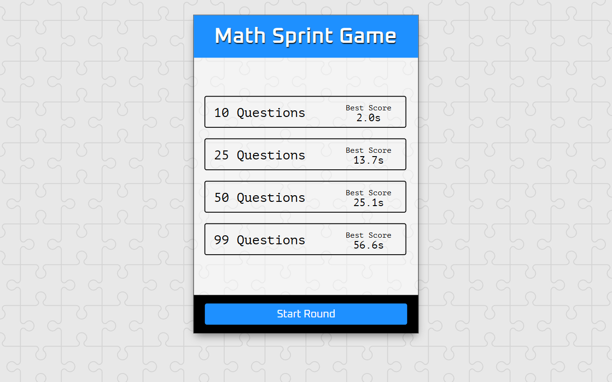

# Math Sprint Game | ZTM JS Web Projects Course

**Project 15/20**

🧮 The **Math Sprint Game** is a web-based app that challenges players to solve multiplication equations as fast as possible. Choose the number of questions, race against the clock, and try to beat your best time saved in `localStorage`.

---

## 📚 Table of Contents

- [🔎 Overview](#-overview)
  - [📸 Screenshot](#-screenshot)
  - [🔗 Links](#-links)
  - [📌 Features](#-features)
- [🧠 My process](#-my-process)
  - [🛠️ Built with](#️-built-with)
  - [🎓 What I learned](#-what-i-learned)
  - [🔙 Previous Project](#-previous-project)
  - [🔜 Next Project](#-next-project)
  - [🗃️ Useful resources](#️-useful-resources)
- [👤 Author](#-author)
  - [🌐 Connect with Me](#-connect-with-me)
  - [💻 Coding Profiles](#-coding-profiles)

---

## 🔎 Overview

### 📸 Screenshot

### 🔗 Links

  - [🔴 Live Demo](https://dalascript.github.io/math-sprint-game/)
  - [🗂️ GitHub Repository](https://github.com/DalaScript/math-sprint-game)

### 📌 Features

  - ✅ Option to choose 10, 25, 50, or 99 questions
  - ✅ Randomly generated correct & incorrect equations
  - ✅ 3-2-1 countdown before each round
  - ✅ Timer scoring with penalty for wrong answers
  - ✅ Best scores saved in localStorage
  - ✅ Replay option with responsive design

---

## 🧠 My Process

### 🛠️ Built with

  - HTML5
  - CSS3
  - Vanilla JavaScript
  - localStorage
  - Custom Shuffle Algorithm

### 🎓 What I Learned

  - Generating and randomizing equations with JavaScript
  - Handling timers, countdowns, and game state
  - Using `localStorage` to persist best scores
  - Managing multi-page flow within one HTML file
  - Building smooth and interactive UI with DOM manipulation

  > 🚀 For me, this project was more about **practice** and gaining additional **experience**,  
  > rather than learning something entirely new.  
  >  
  > 👨‍💻 Since I’m not a beginner and already familiar with these technologies,  
  > I approached it with confidence — and still, I truly **enjoyed working on it**.  
  >  
  > 🎯 Overall, I consider this a very **valuable and enjoyable experience**.

### 🔙 Previous Project

  - NASA APOD | *[Project 14/20]* → [View Repository](https://github.com/DalaScript/nasa-apod)

### 🔜 Next Project

  - Drag and Drop | *[Project 16/20]* → [View Repository](https://github.com/DalaScript/drag-and-drop)

### 🗃️ Useful resources

  - [MDN – Math.random()](https://developer.mozilla.org/en-US/docs/Web/JavaScript/Reference/Global_Objects/Math/random)
  - [MDN – Element.scroll](https://developer.mozilla.org/en-US/docs/Web/API/Element/scroll)
  - [MDN – Number.toFixed()](https://developer.mozilla.org/en-US/docs/Web/JavaScript/Reference/Global_Objects/Number/toFixed)
  - [W3Schools – Hide Scrollbars](https://www.w3schools.com/howto/howto_css_hide_scrollbars.asp)
  - [StackOverflow – Shuffle Array](https://stackoverflow.com/questions/2450954/how-to-randomize-shuffle-a-javascript-array)
  - [W3Schools – JavaScript Timing Events](https://www.w3schools.com/js/js_timing.asp)

---

## 👤 Author

### 🌐 Connect with Me

  - [Instagram](https://www.instagram.com/DalaScript)
  - [YouTube](https://www.youtube.com/@DalaScript)

### 💻 Coding Profiles

  - [freeCodeCamp](https://www.freecodecamp.org/DalaScript)
  - [FrontendMentor](https://www.frontendmentor.io/profile/DalaScript)
  - [GitHub](https://github.com/DalaScript)

*🙌 Thanks for checking out my project! More coming soon. Stay tuned 🚀*
